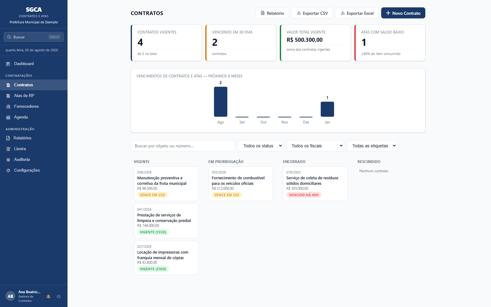
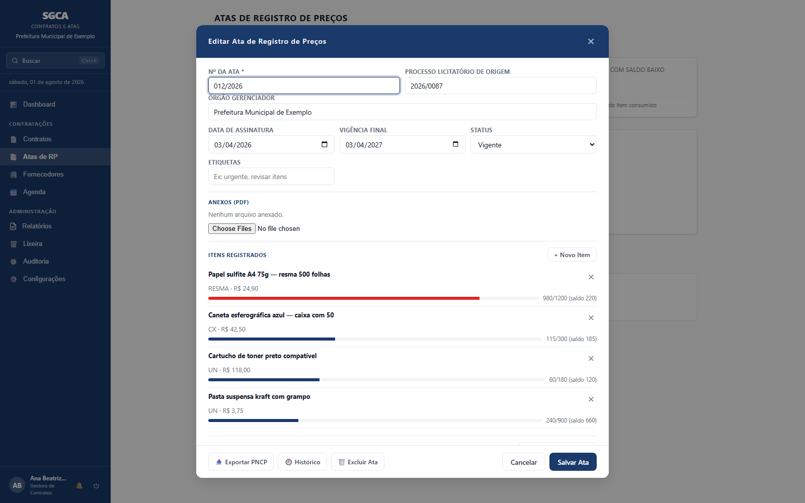
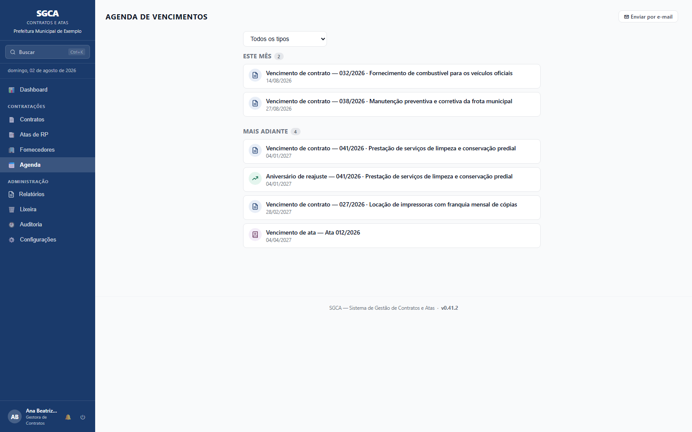

# SGCA — Sistema de Gestão de Contratos e Atas

       [](https://doi.org/10.5281/zenodo.21314676) [](https://github.com/devtulio/sgca/actions/workflows/ci.yml)

## Descrição

O **SGCA** é uma aplicação web multiusuário para o **Departamento de Gestão e Contratos**, destinada ao controle de **Contratos Administrativos** e **Atas de Registro de Preços** conforme a Lei nº 14.133/2021.

O sistema nasceu como uma adaptação estrutural do SGCD (Sistema de Gestão de Contratação Direta), reaproveitando os módulos administrativos que não são específicos de nenhum tipo de processo — autenticação, usuários, fornecedores, auditoria, notificações e backup — e tendo sua arquitetura posteriormente padronizada com a do SGDP (Sistema de Gestão de Documentos da Procuradoria), o "irmão" mais maduro da mesma família — que inclui ainda o **SGEA** (Sistema de Gestão de Estoque do Almoxarifado).

Funciona em rede local: um único computador executa o servidor e todos os usuários acessam pelo navegador via IP ou `localhost`.


<sup>Contratos por situação, com alerta de vencimento e gráfico dos próximos seis meses.</sup>


<sup>Ata de registro de preços: saldo item a item, em vermelho quando o consumo passa de 80% do registrado.</sup>


<sup>Agenda unificada: contratos, atas, garantias, sanções e aniversários de reajuste.</sup>

> As telas acima usam dados fictícios, gerados por `docs/screenshots.spec.js` contra um banco temporário.

---

## Funcionalidades Principais

- **Dashboard geral** — primeira tela após o login, com indicadores consolidados de Contratos e Atas, gráfico de vencimentos dos próximos 6 meses e lista dos próximos vencimentos (contratos, atas, garantias e sanções)
- **Contratos** — cadastro, Kanban por status (Vigente/Em prorrogação/Encerrado/Rescindido), vínculo com fornecedor, aditivos e apostilamentos com alerta de limite legal de 25% (Art. 125, Lei nº 14.133/2021); vigência final calculada automaticamente a partir da vigência inicial (+12 meses), editável manualmente
- **Relatórios gerenciais** — nove documentos em A4 (execução financeira dos contratos, saldo das atas, aditivos do Art. 125, fiscalização, vencimentos e prazos, garantias, recebimento do objeto, contratos por fornecedor e riscos consolidados), considerando todos os registros e não apenas o filtro da tela
- **Atas de Registro de Preços** — cadastro, itens registrados com código e classificação CMMET (Catálogo Municipal de Materiais e Especificações Técnicas), código Fiorilli/SCPI (CADPRO), apresentação comercial e controle de saldo (quantidade utilizada vs. registrada) com alerta visual de esgotamento; vigência final calculada automaticamente a partir da data de assinatura (+12 meses), editável manualmente
- **Documentos gerados** — Extrato de Contrato e Termo Aditivo/Apostilamento (um por tipo: prazo, valor, qualitativo, reequilíbrio, repactuação), no mesmo padrão visual A4 do SGCD
- **Exportação PNCP** — JSON de Contratos e de Atas no formato esperado pelo Portal Nacional de Contratações Públicas, com aviso de campos pendentes
- **Agenda de Vencimentos** unificada — contratos, atas, garantias contratuais, fim de sanções e aniversários de reajuste, agrupados por urgência e filtráveis por tipo, com envio manual ou automático (resumo diário) por e-mail, incluindo aviso individual ao fiscal cadastrado no contrato
- **Exportação de Contratos, Atas, Fornecedores e Trilha de Auditoria em CSV** para planilha, respeitando os filtros ativos na tela
- **Garantia Contratual** — modalidade, valor, vencimento e devolução, com alerta na Agenda de Vencimentos
- **Sanções e Penalidades** — registro interno por fornecedor (advertência, multa, suspensão, impedimento, inidoneidade), com aviso ao selecionar um fornecedor sancionado em um Contrato/Ata e entrada do fim do prazo na Agenda de Vencimentos
- **Reajuste por índice** (IPCA-E, IGP-M, INCC-M, INPC) em aditivos de repactuação/reequilíbrio, com busca automática da variação acumulada no período direto do Banco Central (SGS) e cálculo automático do novo valor global
- **Anexos assinados (PDF, múltiplos)** vinculados ao registro do contrato e da ata
- **Vínculo Contrato ↔ Ata de Registro de Preços** — campo "Ata de Origem" para contratações por adesão a uma ARP nossa; para adesão a ARP de outro órgão gerenciador (não cadastrada no sistema), campos de texto "Nº da ARP de Adesão" e "Órgão Gerenciador de Origem"
- **Gestor do Contrato com e-mail** — recebe o mesmo aviso automático de vencimento e de fiscalização mensal pendente que o fiscal
- **Relatórios consolidados** de Contratos, Atas e Sanções (por fornecedor ou global), no mesmo padrão A4 usado nos demais documentos
- **Indicadores e gráfico de vencimentos** nas telas de Contratos e de Atas — vigentes, vencendo em 30 dias, valor total, saldo baixo e vencimentos dos próximos 6 meses
- **Atalho "Ver Contratos"** a partir do cadastro do fornecedor, e prorrogação assistida (sugestão automática de nova vigência ao criar aditivo de prazo)
- **Numeração automática sugerida** e validação de número duplicado ao cadastrar Contrato/Ata
- **Filtro por Fiscal** na tela de Contratos, e alerta de "Contratos sem Fiscal" no Dashboard (Art. 117, Lei 14.133/2021)
- **Busca global** (botão na sidebar ou atalho Ctrl+K) — pesquisa por número, objeto, órgão gerenciador e fornecedor em todos os Contratos e Atas, com acesso direto ao registro
- **Histórico do registro** — botão "🕘 Histórico" no Contrato/Ata mostra a trilha de auditoria filtrada só para aquele registro
- **Fiscalização Mensal** no Contrato — data, fiscal, parecer e observações, com alerta "Fiscalização Atrasada" no Dashboard quando um contrato vigente fica mais de 45 dias sem registro (Art. 117)
- **Matriz de Risco** do Contrato — riscos com probabilidade, impacto, mitigação e responsável, com documento gerável (Art. 22)
- **Recebimento do Objeto** — datas e responsáveis pelo recebimento provisório e definitivo, com Termo de Recebimento gerável (Art. 140)
- **Subcontratação** — CNPJ, razão social e percentual do subcontratado, com alerta se o total ultrapassar o limite definido para o contrato (Art. 122); o CNPJ informado é resolvido contra o cadastro de fornecedores e, se ainda não estiver lá, consultado na Receita Federal e cadastrado automaticamente
- **Item do Plano de Contratações Anual (PCA)** — campo de rastreabilidade no Contrato (Art. 12, Lei 14.133/2021 / IN SEGES nº 81/2022)
- **Alerta de vigência total próxima do limite legal** — soma da vigência inicial com todas as prorrogações, aviso configurável por contrato (Art. 107)
- **Aniversário de reajuste** na Agenda de Vencimentos — lembrete 12 meses após o último aditivo de reequilíbrio/repactuação (ou desde a assinatura, se nunca houve um)
- **Lembrete de Fiscalização Mensal por e-mail** — aviso automático ao fiscal e ao gestor quando o contrato passa 30 dias sem registro de fiscalização
- **Documentos gerados reanexáveis** — Extrato, Termos Aditivos, Matriz de Risco e Termo de Recebimento podem ser salvos como PDF e reanexados ao contrato, guardados junto dos demais anexos
- **Autenticação multiusuário** com hashing PBKDF2-HMAC-SHA256 e gestão de usuários pelo admin
- **Cadastro de fornecedores** com consulta automática de CNPJ via ReceitaWS/BrasilAPI, controle de certidões com alertas de vencimento e exclusão (lixeira) — bloqueada enquanto o fornecedor tiver contratos ou atas vinculados
- **Selo de alerta na linha do Fornecedor** conforme o Diagnóstico de Integridade — "🔴 CNPJ duplicado" ou "🟡 CNPJ inválido" na tabela de Fornecedores, indicando o motivo
- **Importação de fornecedores via CSV** e relatório consolidado
- **Configurações** — dados do órgão, brasão, tema claro/escuro, SMTP
- **Notificações in-app** — alertas de certidões de fornecedores vencendo
- **Trilha de auditoria global** — tabela com filtros por tipo de evento, período e usuário (vocabulário próprio do domínio de contratos/atas)
- **Backup automático** ao encerrar o sistema (JSON + banco de dados SQLite) com rotação configurável
- **Sincronização por backup JSON entre instalações do SGCA** — mescla os dados de outra máquina com os atuais, sem substituir o banco inteiro, com revisão dos registros alterados dos dois lados
- **Cadastro de fornecedores compartilhado com SGCD/SGEA** — botões "Exportar cadastro" e "Sincronizar cadastro", casando os fornecedores por CNPJ, com tela de revisão registro a registro quando o mesmo fornecedor mudou nos dois sistemas
- **Exclusão de Contratos e Atas** — move para a Lixeira após confirmação em três etapas (mesmo rigor do Factory Reset), com alerta informativo se houver fornecedor vinculado
- **Lixeira** — fornecedores, contratos e atas excluídos ficam recuperáveis por 30 dias
- **Termo de Rescisão** — documento formal gerado quando o status do Contrato é "Rescindido" (Art. 137 a 139, Lei nº 14.133/2021)
- **Execução Financeira** do Contrato e da Ata — registro de pagamentos (data, valor, nº de empenho/nota fiscal) com saldo calculado automaticamente contra o valor global/registrado
- **Alimentar do Fiorilli** — importa o relatório "Listagem de Licitações Integradas e Pedidos" (módulo Compras 07.05.02, CSV) do sistema contábil oficial e preenche a quantidade utilizada de cada item das Atas pela quantidade líquida pedida (Σ pedidos − Σ cancelamentos), casando por processo licitatório + código Fiorilli; somente leitura sobre o Fiorilli e idempotente, com prévia por ata (saldo negativo sinalizado) e lista dos itens ainda sem código cadastrado
- **Consulta CEIS/CNEP automatizada** — sanções federais por CNPJ via API do Portal da Transparência/CGU, no cadastro de Fornecedores
- **Exportação em Excel (.xlsx)**, além de CSV, em Contratos, Atas, Fornecedores e Auditoria
- **Marca d'água "MINUTA"** — todo documento gerado a partir de um contrato sai marcado como minuta enquanto não houver um PDF assinado anexado ao registro; os relatórios gerenciais nunca recebem a marca
- **Bloqueio de edição concorrente** — ao salvar, o sistema detecta se o registro foi alterado por outro usuário depois que a tela foi carregada e avisa, em vez de sobrescrever silenciosamente o trabalho alheio
- **Faixa de aviso de servidor desatualizado** — quando o servidor em execução é mais antigo que a página carregada (atualização aplicada sem reiniciar), uma faixa no topo orienta a reiniciar antes que funções novas falhem
- **Painel "Erros recentes"** (Configurações → Diagnóstico, só admin) — erros registrados no log, agrupados por tipo e contagem, incluindo os ocorridos no navegador dos usuários
- **Etiquetas (tags)** em Contratos e Atas — marcadores livres com sugestão dos valores já usados, exibidos nos cards e filtráveis por "Todas as etiquetas"
- **Diagnóstico e correção automática de rede** — verifica IP, porta, perfil de rede e firewall

> Fora de escopo por decisão de projeto: execução orçamentária/financeira completa (empenho, liquidação, pagamento formal) integrada ao sistema contábil do órgão — o SGCA registra apenas um controle simples de pagamentos por contrato/ata, não substitui o sistema financeiro oficial.

---

## Requisitos

- **Python 3.7+**
- **Google Chrome** ou **Microsoft Edge** (recomendado)
- Windows 10/11
- **Nada a instalar** — além da biblioteca padrão do Python, o servidor usa o **waitress** (servidor WSGI puro-Python), que vem **vendorizado** na pasta `waitress/` do próprio repositório. Não há `pip install`, nem download, nem acesso à internet na instalação

> **Servidor sem Python instalado (ex.: Windows Server bloqueado por política de TI):**
> o `Iniciar SGCA.bat` detecta automaticamente a ausência do Python e extrai uma versão portátil (embarcável, sem instalador) incluída no próprio projeto (`python-3.12.9-embed-amd64.zip`) para `C:\Python312-embed\` — não exige instalação nem privilégio de administrador.

---

## Instalação e uso

1. Copie a pasta `SGCA/` para o computador que atuará como servidor
2. Clique duas vezes em **`Iniciar SGCA.bat`**
3. Selecione o modo de operação no menu que aparecer
4. Faça login com as credenciais iniciais abaixo e **altere a senha imediatamente**

> ⚠️ **Importante:** abrir o `SGCA.html` diretamente pelo navegador (sem o servidor) impede o funcionamento do sistema. Use sempre o `Iniciar SGCA.bat`.

### Login inicial

| Campo   | Valor       |
|---------|-------------|
| Usuário | `admin`     |
| Senha   | `admin123`  |

### Menu de inicialização

O `Iniciar SGCA.bat` abre um menu no terminal:

| Opção | Descrição |
|-------|-----------|
| **[1] Diagnóstico** | Verifica e corrige automaticamente rede, porta e firewall (pede elevação de Administrador quando necessário) |
| **[2] Iniciar Servidor** | Sobe o servidor e mantém rodando continuamente — atende uso individual e em rede. Só encerra com **Ctrl+C** no terminal ou fechando a janela |

### Acesso em rede local

O sistema foi projetado para uso multiusuário em rede local (LAN): **uma única máquina executa o servidor** (e guarda o banco de dados) e as demais acessam pelo navegador, sem instalar nada.

**Na máquina servidora (uma vez só):**

1. Execute **`Liberar Porta SGCA.bat`** como Administrador (botão direito → *Executar como administrador*) — cria a regra no Firewall do Windows liberando a porta 3002 para conexões de entrada
2. Inicie o sistema pelo `Iniciar SGCA.bat` e deixe a máquina ligada — ao iniciar, o console mostra o endereço de rede pronto para distribuir (`Rede: http://<IP>:3002/SGCA.html`)

**Nas outras máquinas:** basta abrir o navegador (Chrome ou Edge) no endereço do servidor:

```
http://192.168.x.x:3002/SGCA.html
```

Cada usuário faz login com sua própria conta — o servidor atende acessos simultâneos e todos enxergam os mesmos dados.

Se a conexão não funcionar, execute **`Diagnostico SGCA.bat`** (ou a opção **[1]** do `Iniciar SGCA.bat`) na máquina servidora: ele descobre o IP e verifica/corrige automaticamente firewall e perfil de rede.

> ⚠️ **Uso restrito à rede interna.** A comunicação é HTTP simples (sem criptografia de transporte) — adequado para uma LAN interna confiável, mas **nunca exponha a porta do sistema à internet** (redirecionamento de porta no roteador, DMZ etc.). Para acesso remoto, use a VPN institucional.

---

## Estrutura de arquivos

```
SGCA/
├── SGCA.html                # Frontend — aplicação web
├── server.py                # Servidor Python (API REST + SQLite) — porta 3002
├── base.css                  # Folha de estilo compartilhada da família (cópia distribuída)
├── base.js                   # Utilitários JS compartilhados da família (cópia distribuída)
├── sgx_base.py               # Infraestrutura Python compartilhada da família (cópia distribuída)
├── _esqueleto.sha256         # Manifesto de conferência das cópias compartilhadas
├── waitress/                 # Servidor WSGI vendorizado (puro-Python, sem instalação)
├── scripts/                  # Scripts de apoio (verificação do esqueleto, lint)
├── tests/                    # Suíte de testes automatizados do backend
│   ├── test_server.py
│   └── e2e/                  # Testes E2E (Playwright) — navegador real de ponta a ponta
├── Iniciar SGCA.bat          # Inicializa o servidor
├── python-3.12.9-embed-amd64.zip  # Python portátil (fallback se não houver Python instalado)
├── get-pip.py                # Usado só pelo script acima (Python embarcável não vem com pip)
├── Criar Atalho SGCA.bat     # Cria atalho na área de trabalho com ícone
├── Criar Atalho SGCA.ps1     # Script PowerShell de criação do atalho
├── Diagnostico SGCA.bat      # Roda o diagnóstico de rede (clique duplo)
├── Liberar Porta SGCA.bat    # Cria regra de firewall para a porta (Admin)
├── Perguntar Onde Salvar Downloads.reg  # Política do navegador: perguntar onde salvar cada download (Admin)
├── diagnostico.py            # Script de diagnóstico de rede e firewall
├── sgca.ico                  # Ícone do sistema
├── sgca.db                   # Banco de dados SQLite (criado automaticamente)
├── uploads/                  # Anexos armazenados (criado automaticamente)
├── backups/                  # Backups automáticos (criado automaticamente)
├── requirements.txt          # Nada a instalar (stdlib do Python + waitress vendorizado)
├── README.md
├── CHANGELOG.md
└── MANUAL.html
```

---

## Documentos Gerados pelo Sistema

| Documento | Descrição |
|-----------|-----------|
| **Extrato de Contrato** | Extrato para publicação no Diário Oficial e no PNCP |
| **Termo Aditivo** | Formalização de acréscimo, supressão ou prorrogação contratual |
| **Termo de Recebimento** | Registro do recebimento do objeto |
| **Termo de Rescisão** | Formalização da rescisão contratual |
| **Matriz de Risco** | Quadro de riscos do contrato |
| **Relatório de Contratos / Atas** | Visão consolidada com os filtros aplicados |
| **Relatório de Fornecedores** | Cadastro de fornecedores com certidões |
| **Relatório de Sanções** | Fornecedores sancionados (CEIS/CNEP) |
| **Relatório de Auditoria** | Trilha de eventos do sistema |
| **Relatório de Integridade** | Estado do banco, backups e contagens |

Todos os documentos abrem em janela separada com botão "🖨 Imprimir / Salvar PDF".

---

## Base Legal

Dispositivos da **Lei Federal nº 14.133/2021** que o sistema acompanha:

| Dispositivo | Onde aparece no sistema |
|---|---|
| **Art. 94 c/c Art. 91, §4º** | Extrato para divulgação no PNCP |
| **Art. 107** | Duração máxima do contrato, incluindo prorrogações |
| **Art. 117** | Designação e controle do fiscal do contrato |
| **Art. 122** | Subcontratação |
| **Art. 125** | Limites de acréscimo e supressão em aditivos |
| **Art. 140** | Recebimento do objeto |
| **Art. 156, III** | Sanções — impedimento de licitar |

---

## Segurança

- Senhas armazenadas com **PBKDF2-HMAC-SHA256** e salt aleatório por usuário
- Sessões server-side invalidadas automaticamente por inatividade
- Acesso à API exige token de sessão em todas as rotas (exceto login e verificação)
- Trilha de auditoria imutável registra todas as ações com usuário e timestamp
- Verificação de integridade do banco de dados (SQLite `PRAGMA integrity_check`) na inicialização
- Recomenda-se uso em rede interna (LAN) apenas

---

## Tecnologias

| Tecnologia | Uso |
|-----------|-----|
| **HTML5 + CSS3** | Interface da aplicação, temas claro/escuro, layout responsivo |
| **JavaScript puro (ES6+)** | Toda a lógica de negócio, sem frameworks externos |
| **Python 3 (stdlib)** | Servidor local: REST API, SQLite, auth, SMTP, proxy CNPJ |
| **waitress (vendorizado)** | Servidor WSGI que atende as requisições — puro-Python, incluído na pasta `waitress/` do repositório, sem instalação |
| **SQLite** | Armazenamento persistente dos dados (`sgca.db`) |
| **ReceitaWS / BrasilAPI** | Consulta de CNPJ (primária + fallback automático) |
| **ViaCEP** | Preenchimento automático de endereço por CEP |

---

## Desenvolvimento

O sistema em si não exige instalação de nada: Python stdlib + HTML puro, mais o **waitress** vendorizado em `waitress/` — não é biblioteca padrão, mas viaja junto do repositório, então não há passo de instalação de dependências. Para quem for alterar o código, há um lint opcional que verifica variáveis indefinidas no JavaScript de `SGCA.html`:

```bash
npm install   # uma vez, instala apenas o ESLint (ferramenta de dev, não é usada em produção)
npm run lint
```

Parte do código é compartilhada com os outros sistemas da família (SGCD, SGDP e SGEA): `base.css`, `base.js` e `sgx_base.py` são cópias distribuídas a partir de uma fonte única, que fica fora deste repositório. Editar essas cópias aqui funciona e passa no lint — mas a alteração é silenciosamente sobrescrita na próxima distribuição. Por isso o CI confere as cópias contra o manifesto `_esqueleto.sha256` e quebra o build se elas divergirem:

```bash
python scripts/verificar_esqueleto.py
```

Há também uma suíte de testes automatizados do backend (`server.py`), usando só `unittest` da stdlib — sobe o servidor real contra um banco e uploads temporários e testa os endpoints REST (login, contratos, atas, fornecedores, auditoria, configurações, usuários, backup):

```bash
python -m unittest discover -s tests -v
```

Há também uma suíte de testes E2E (`tests/e2e/`), usando Playwright — sobe o servidor real e dirige um Chromium de verdade pelo fluxo completo (login com troca de senha obrigatória, criar contrato):

```bash
npm install
npx playwright install chromium   # uma vez, baixa o navegador de teste
npm run test:e2e
```

Roda contra um banco/uploads/backups temporários (nunca o `sgca.db` real), criados e descartados automaticamente a cada execução.

---

## Versionamento

Consulte o [CHANGELOG.md](CHANGELOG.md) para o histórico completo de versões e alterações.

---

## Sistemas irmãos

Quatro sistemas livres para a administração pública municipal, com a mesma
arquitetura: servidor Python + SQLite e frontend single-file, multiusuário em
rede local.

| Sistema | Cuida de | |
|---|---|---|
| **SGCD** — Contratação Direta | dispensas de licitação, do pedido ao contrato | [repositório](https://github.com/devtulio/sgcd) |
| **SGCA** — Contratos e Atas | contratos administrativos e atas de registro de preços | **(este)** |
| **SGDP** — Documentos da Procuradoria | leis, decretos, portarias, pareceres e ofícios | [repositório](https://github.com/devtulio/sgdp) |
| **SGEA** — Estoque do Almoxarifado | entradas, saídas, lote e validade com FEFO | [repositório](https://github.com/devtulio/sgea) |

---

## Como citar

Cada versão publicada recebe um DOI próprio no Zenodo; o DOI abaixo é o do
projeto e resolve sempre para a versão mais recente.

> SILVA, T. R. M. **SGCA: sistema de gestão de contratos e atas**. Zenodo. https://doi.org/10.5281/zenodo.21314676

---

## Contribuição

Contribuições são bem-vindas! Veja o [CONTRIBUTING.md](CONTRIBUTING.md) para orientações sobre como reportar bugs, sugerir funcionalidades e enviar Pull Requests.

---

## Licença

[MIT](LICENSE) — © 2026 Túlio Ribeiro de Moura e Silva.

> **Aviso:** Os dados ficam armazenados no arquivo `sgca.db` na pasta do sistema. Faça backups regulares em **Configurações → Backup de Dados** e mantenha cópia do `sgca.db` em local seguro.
